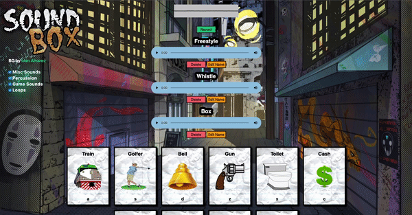

<h1>Sound Box</h1>
This project is a sound board that provides users with different kinds of sounds they can play around with in order to make a simple beat and/or song. Users are able to record themselves as well and playback their recordings as each one logs itself. Clicking the buttons or pressing any of the assigned keys will produce the sounds they're assigned to. Mixing and matching different sounds can create interesting tunes!
 
 

This is a fun project I made that allowed me to practice more with all kinds of different functions, methods and ways of connectivity. Accessing the BOM and utilizing what I can from it in the DOM, playing around with event listeners, binding children to parents and so much more are all examples of what I was able to practice with. The goal of this project was to get more experience with connectivity and I definitely have a much better understanding of how everything works.
 
 

Thank You!
